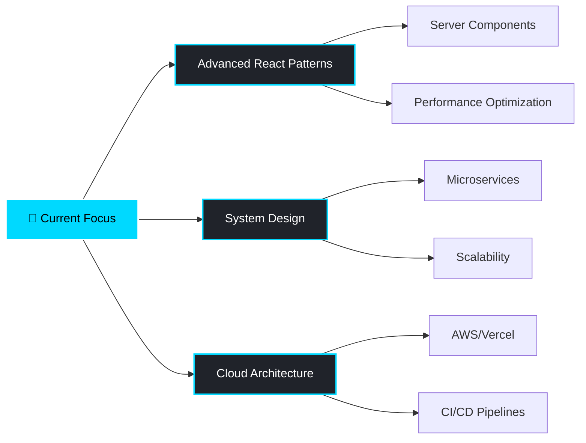

<div align="center">

<!-- Animated Header -->


</div>

<div align="center">
  
### 👨‍💻 CS Student from Kurdistan 🇹🇯 | Building the Future, One Line at a Time

[](https://reband.site/)
[](https://www.instagram.com/rebandhamadameen/)
[](mailto:rebandhamadameen@gmail.com)

</div>

---

## 🚀 About Me

```typescript
const reband = {
    location: "Kurdistan 🏔️",
    education: "Stage Three Computer Science Student 🎓",
    role: "Full Stack Developer",
    specialization: "React & Modern Web Development 💎",
    passion: "Building modern, responsive, and lightning-fast web experiences",
    philosophy: "Code is a tool to build the future — and I'm here to shape it",
    currentFocus: ["React Ecosystem", "Modern Web Architecture", "User Experience"],
    lifeGoal: "Transform ideas into digital realities"
};
```

<div align="center">

### 💡 What Drives Me

*I blend **academic knowledge** with **real-world development** to solve problems and create beautiful digital experiences. As a proud member of **The S**, I'm part of a passionate Kurdish dev team building creative and practical web solutions for real-world problems.*

</div>

---

## 🛠️ Tech Arsenal

<div align="center">

### Frontend Mastery


### Backend & Database


### Tools & Platforms


</div>

---

## 🌟 Featured Projects

<div align="center">

<table>
<tr>
<td width="50%">

### 🎨 Personal Portfolio
[](https://reband.site/)

**Tech Stack:** Next.js 14 • TailwindCSS • TypeScript  
**Features:**
- ⚡ Lightning-fast performance
- 🎭 Smooth animations & transitions
- 📱 Fully responsive design
- 🌙 Dark mode optimized

</td>
<td width="50%">

### 🎬 Movie Streaming App


**Tech Stack:** React • TMDb API • Node.js  
**Features:**
- 🔍 Advanced search & filters
- 🎥 Embedded trailers
- 📊 Trending & popular sections
- ⭐ User ratings integration

</td>
</tr>
<tr>
<td width="50%">

### 📚 Course Manager


**Tech Stack:** React • Google Drive API • Express  
**Features:**
- 📹 Video lecture management
- 🔗 Google Drive integration
- 📂 Organized course structure
- 🎯 Progress tracking

</td>
<td width="50%">

### 🚀 More Coming Soon...


**Exploring:**
- 🤖 AI-powered applications
- 🎮 Web3 & blockchain projects
- 📊 Data visualization tools
- 🛒 E-commerce solutions

</td>
</tr>
</table>

</div>

---

## 📊 GitHub Statistics

<div align="center">
  


</div>

---

## 👥 The S Team

<div align="center">


**The S** is more than just a team — it's a collective of creative minds from Kurdistan dedicated to building innovative digital solutions. We combine cutting-edge technology with cultural authenticity to create impactful web applications.

</div>

---

## 💭 Current Learning Journey

<div align="center">



</div>

---

## 🎯 2026 Goals

- [ ] 🚀 Launch 3 major open-source projects
- [ ] 📝 Write technical blogs and tutorials
- [ ] 🤝 Contribute to major open-source repositories
- [ ] 🎓 Complete Advanced Web Development certifications
- [ ] 💼 Expand **The S** team's portfolio with client projects
- [ ] 🌍 Connect with global developer communities

---

## 📬 Let's Connect & Collaborate

<div align="center">

**I'm always open to interesting conversations and collaboration opportunities!**

Whether you want to discuss web development, explore project ideas, or just chat about technology — feel free to reach out.

[](https://reband.site/)
[](https://www.instagram.com/rebandhamadameen/)
[](mailto:rebandhamadameen@gmail.com)

</div>

---

<div align="center">

### 💬 Philosophy

*"Code is a tool to build the future — and we're here to shape it."*

**— Proud CS Student & Member of The S 🇹🇯**

---


</div>
